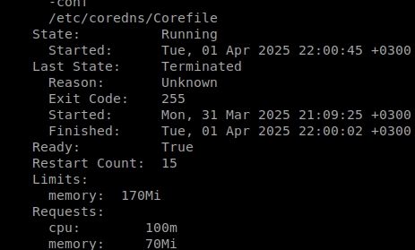

# Домашнее задание к занятию «Компоненты Kubernetes»

### Цель задания

Рассчитать требования к кластеру под проект

------

### Инструменты и дополнительные материалы, которые пригодятся для выполнения задания:

- [Considerations for large clusters](https://kubernetes.io/docs/setup/best-practices/cluster-large/),
- [Architecting Kubernetes clusters — choosing a worker node size](https://learnk8s.io/kubernetes-node-size).

------

### Задание. Необходимо определить требуемые ресурсы
Известно, что проекту нужны база данных, система кеширования, а само приложение состоит из бекенда и фронтенда. Опишите, какие ресурсы нужны, если известно:

> 1. Необходимо упаковать приложение в чарт для деплоя в разные окружения. 
> 2. База данных должна быть отказоустойчивой. Потребляет 4 ГБ ОЗУ в работе, 1 ядро. 3 копии. 
> 3. Кеш должен быть отказоустойчивый. Потребляет 4 ГБ ОЗУ в работе, 1 ядро. 3 копии. 
> 4. Фронтенд обрабатывает внешние запросы быстро, отдавая статику. Потребляет не более 50 МБ ОЗУ на каждый экземпляр, 0.2 ядра. 5 копий. 
> 5. Бекенд потребляет 600 МБ ОЗУ и по 1 ядру на копию. 10 копий.

Соответственно у нас 10 беков и 10 "всего остального". А дальше все зависит от кластера.

Примерно прикинем "накладные расходы" - на под CoreDNS по top у меня уходит 0.6% памяти от 32 ГБ ноды - это 200 мб:

при минимуме 70 и максимуме описанном как 170 в поде.

`Если у нас кластер из 3 воркеров, то:`

В моем полупустом кластере скорее всего все работает по минимуму, в связи с чем получаем перерасход по памяти на накладные расходы кубера 130 мб/контейнер. Прибавляем в табличку:

`Если у нас кластер из 3 воркеров, то:`

| нода | колво беков 10x1CPU/0.6RAM | колво субд 3x1CPU/4RAM | колво кешей 3x1CPU/4RAM | кол-во фронтов 5x0.2CPU/0.05RAM | сумма ресурсов |
| ------ | ----- | ----- | -----| ----- | ----- |
| 1 нода | 4 | 1 | 1 | 1 | CPU 6.2 RAM 10.45 |
| 2 нода | 3 | 1 | 1 | 2 | CPU 5.4 RAM 9.9 |
| 3 нода | 3 | 1 | 1 | 2 | CPU 5.4 RAM 9.9 |

(разумеется мы не знаем, на какую ноду придется какая нагрузка, но если scheduler заполняет все последовательно - должно быть так).

Итого CPU 17 RAM 32.98. А на каждую ноду примерно 6.5vCPU , 11 RAM
Но рассматривая вариант потери ноды (отказоустойчивость же) нагрузка распределится по оставшимся двум нодам:

CPU = (17)/2 = 8.5
RAM = 32.98/2 = 16.5

`Перерасход CPU в таком случае у нас по нодам 2-3 ядра на каждой (примерно 5.6 ядер), памяти 2.73 гб`

Соответственно, нам нужно 9 vCPU и 17 RAM. Разумеется, какие-то накладные расходы от куба по CPU также будут, но их просчитать у меня нет идей как. 

Отдельно стоит заметить, что у нас 10 экземпляров бека, и "10 всего остального", в связи с чем если бы у нас был бы кластер из 10 нод, то при потери одной ноды ресурсы были бы нужны значительно меньшие:

В нормальном режиме CPU=17/10=1.7/нода, RAM=32.98/10=3.298/нода
В режиме отказа одной ноды CPU = 1.7*1.11=1.887/нода, RAM = 36.6078/нода

`Перерасход CPU в таком случае (1.887-1.7)*9=1.7 ядра, памяти (36.60-32.98)*9=32.58 гб.`

Вывод - размер инсталляции существенно влияет на отказоустойчивость.

----

### Правила приёма работы

1. Домашняя работа оформляется в своем Git-репозитории в файле README.md. Выполненное домашнее задание пришлите ссылкой на .md-файл в вашем репозитории.
2. Сначала сделайте расчёт всех необходимых ресурсов.
3. Затем прикиньте количество рабочих нод, которые справятся с такой нагрузкой.
4. Добавьте к полученным цифрам запас, который учитывает выход из строя как минимум одной ноды. 
5. Добавьте служебные ресурсы к нодам. Помните, что для разных типов нод требовния к ресурсам разные. 
6. В результате должно быть указано количество нод и их параметры.

